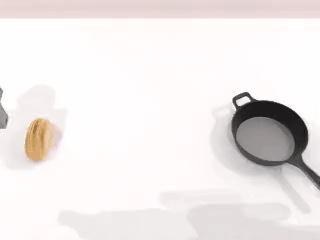

<h2 align="center"> Towards Generalizable Robotic Manipulation in Dynamic Environments </h2>

<div align="center">
    <a href="https://arxiv.org/abs/2603.15620"></a>
    <a href="https://h-embodvis.github.io/DOMINO/"></a>
    <a href="https://huggingface.co/datasets/h-embodvis/DOMINO"></a>
    <a href="https://huggingface.co/H-EmbodVis/PUMA"></a>
    <a href="https://www.modelscope.cn/datasets/H-EmbodVis/DOMINO"></a>
    <a href="https://opensource.org/licenses/Apache-2.0"></a>

<h5 align="center"><em>Heng Fang<sup>1</sup>, Shangru Li<sup>1</sup>, Shuhan Wang<sup>1</sup>, Xuanyang Xi<sup>2</sup>, <a href="https://dk-liang.github.io/">Dingkang Liang</a><sup>1,†</sup>, <a href="https://scholar.google.com/citations?user=UeltiQ4AAAAJ&hl=en">Xiang Bai</a><sup>1</sup> </em></h5>
<sup>1</sup> Huazhong University of Science and Technology, <sup>2</sup> Huawei Technologies Co. Ltd, <sup>†</sup> Corresponding Author
</div>


## 🔍 Overview

Dynamic manipulation requires robots to continuously adapt to moving objects and unpredictable environmental changes. Existing Vision-Language-Action (VLA) models rely on static single-frame observations, failing to capture essential spatiotemporal dynamics. We introduce **DOMINO**, a comprehensive benchmark for this underexplored frontier, and **PUMA**, a predictive architecture that couples historical motion cues with future state anticipation to achieve highly reactive embodied intelligence.

<div  align="center">    
 
</div>

<details>
  <summary>Abstract
  </summary>

Vision-Language-Action (VLA) models excel in static manipulation but struggle in dynamic environments with moving targets. This performance gap primarily stems from a scarcity of dynamic manipulation datasets and the reliance of mainstream VLAs on single-frame observations, restricting their spatiotemporal reasoning capabilities. To address this, we introduce DOMINO, a large-scale dataset and benchmark for generalizable dynamic manipulation, featuring 35 tasks with hierarchical complexities, over 110K expert trajectories, and a multi-dimensional evaluation suite. Through comprehensive experiments, we systematically evaluate existing VLAs on dynamic tasks, explore effective training strategies for dynamic awareness, and validate the generalizability of dynamic data. Furthermore, we propose PUMA, a dynamics-aware VLA architecture. By integrating scene-centric historical optical flow and specialized world queries to implicitly forecast object-centric future states, PUMA couples history-aware perception with short-horizon prediction. Results demonstrate that PUMA achieves state-of-the-art performance, yielding a 6.3% absolute improvement in success rate over baselines. Moreover, we show that training on dynamic data fosters robust spatiotemporal representations that transfer to static tasks.
</details>


### 📰 News

**[2026/08/18]** 🚀 PUMA now supports **training on Huawei Ascend NPUs**: NVIDIA weights train as-is with DeepSpeed ZeRO-2, and the CUDA path stays untouched — see the [Ascend training guide](policy/PUMA/docs/ascend_training.md).

**[2026/07/31]** 🚀 PUMA now runs **inference on Huawei Ascend NPUs**: NVIDIA-trained checkpoints work directly on Atlas 910 with no weight conversion — see the [Ascend inference guide](policy/PUMA/docs/ascend_inference.md).

**[2026/06/18]** 🎉 DOMINO has been accepted to **ECCV 2026**!

**[2026/05/29]** 🙏 Special thanks to the [Qwen team](https://github.com/QwenLM) for using DOMINO in [Qwen-VLA](https://arxiv.org/abs/2605.30280) as a **dynamic manipulation OOD benchmark**! We welcome everyone to try DOMINO for evaluating VLA robustness.

**[2026/04/22]** 🔥 DOMINO now supports the [StarVLA](https://github.com/starVLA/starVLA) codebase! Evaluation code is available [here](https://github.com/starVLA/starVLA/tree/starVLA_dev/examples/DOMINO).

**[2026/03/30]** 🚀 We now release the PUMA training/evaluation code and the [PUMA checkpoint](https://huggingface.co/H-EmbodVis/PUMA).

**[2026/03/28]** 🔥 The DOMINO dataset is now available on [Hugging Face](https://huggingface.co/datasets/h-embodvis/DOMINO) and [ModelScope](https://www.modelscope.cn/datasets/H-EmbodVis/DOMINO).

**[2026/03/24]** 🚀 We release the DOMINO benchmark code, including setup, data collection, and policy evaluation instructions.

**[2026/03/17]** 🎉 We release the [paper](https://arxiv.org/abs/2603.15620), [project homepage](https://h-embodvis.github.io/DOMINO/), and visual demos.


### 🎥 Visual Demos

More visual demos can be found on our [project homepage](https://h-embodvis.github.io/DOMINO/).

<div align="center">
  
  
  
</div>
<div align="center">
  
  
  
</div>

### ✨ Key Idea

* Current VLA models struggle with dynamic manipulation tasks due to a scarcity of dynamic datasets and a reliance on single-frame observations.
* We introduce DOMINO, a large-scale benchmark for dynamic manipulation comprising 35 tasks and over 110K expert trajectories.
* We propose PUMA, a dynamics-aware VLA architecture that integrates historical optical flow and world queries to forecast future object states.
* Training on dynamic data fosters robust spatiotemporal representations, demonstrating enhanced generalization capabilities.


## 📅 TODO
* [x] Release the paper
* [x] Release DOMINO benchmark code
* [x] Release DOMINO dataset on [HuggingFace](https://huggingface.co/datasets/h-embodvis/DOMINO) and [ModelScope](https://www.modelscope.cn/datasets/H-EmbodVis/DOMINO)
* [x] Release PUMA training code and evaluation code
* [x] Release PUMA checkpoint on [HuggingFace](https://huggingface.co/H-EmbodVis/PUMA)
* [x] Support [StarVLA](https://github.com/starVLA/starVLA) codebase (evaluation code available [here](https://github.com/starVLA/starVLA/tree/starVLA_dev/examples/DOMINO))
* [x] Add real-world evaluation results
* [x] Support Huawei Ascend NPUs — PUMA inference ([guide](policy/PUMA/docs/ascend_inference.md))
* [x] Support Huawei Ascend NPUs — PUMA training ([guide](policy/PUMA/docs/ascend_training.md))


## 🛠️ Getting Started

This project is divided into two main components that operate in separate environments and communicate via WebSockets:
- **DOMINO**: The simulation environment and data generation pipeline.
- **PUMA**: The Vision-Language-Action policy framework.

You will need to set up both environments to run the full pipeline.

### 1. DOMINO (Simulation & Data Pipeline)

#### 1.0. System Requirements
- **OS**: Linux (Windows/MacOS have limited or no support)
- **Hardware**: NVIDIA GPU (RTX recommended for ray tracing)
- **Software**: Python 3.10, CUDA 12.1 (Recommended), NVIDIA Driver >= 520

*Note: If running inside a Docker container, you must include the graphics capability to avoid Vulkan-related segmentation faults:*
```bash
docker run ... -e NVIDIA_DRIVER_CAPABILITIES=compute,utility,graphics
```

#### 1.1. Installation Steps

**Step 1: Install System Dependencies**
Ensure Vulkan and FFmpeg are installed on your system:
```bash
sudo apt update
sudo apt install libvulkan1 mesa-vulkan-drivers vulkan-tools ffmpeg
```
*(Verify installations by running `vulkaninfo` and `ffmpeg -version`)*

**Step 2: Create Conda Environment**
```bash
conda create -n domino python=3.10 -y
conda activate domino
```

**Step 3: Clone and Install**
```bash
git clone https://github.com/h-embodvis/DOMINO.git
cd DOMINO

# Install basic environments and CuRobo
bash script/_install.sh
```
*Troubleshooting: If you encounter a CuRobo config path issue, run `python script/update_embodiment_config_path.py`. A failed PyTorch3D installation won't affect core functionality unless you are using 3D data.*

**Step 4: Download Assets**
Download the required assets (RoboTwin-OD, Texture Library, and Embodiments). If you hit rate limits, log in to Hugging Face first (`huggingface-cli login`).
```bash
bash script/_download_assets.sh
```

#### 1.2. Data Collection

We provide an automated pipeline for data collection. You can collect data by running:

```bash
bash collect_data.sh ${task_name} ${task_config} ${gpu_id}
# Example: bash collect_data.sh adjust_bottle demo_clean_dynamic 0
```

After collection, the data will be stored under `data/${task_name}/${task_config}` in **HDF5 format**. For the full data collection process and common issues, please refer to the [RoboTwin Data Collection Tutorial](https://robotwin-platform.github.io/doc/usage/collect-data.html).

**Dynamic Task Configurations**

To enable dynamic environments, we introduce four specific configurations in the task config files (e.g., `task_config/demo_clean_dynamic.yml` and `task_config/demo_random_dynamic.yml`):

<details>
<summary><b>Click to view Dynamic Configurations</b></summary>

- `use_dynamic` (bool): Whether to enable dynamic motion in the environment (e.g., moving objects).
- `dynamic_level` (int): The complexity level of the dynamic motion (1, 2, or 3). Higher levels introduce more challenging dynamic behaviors.
- `dynamic_coefficient` (float): A scaling factor (default: 0.1) that controls the speed of the dynamic movements.
- `check_render_success` (bool): Whether to verify rendering success during data collection, ensuring that dynamic interactions do not cause visual or physical glitches.

</details>

For all other detailed configurations (like domain randomization, cameras, and data types), we maintain the original RoboTwin 2.0 settings. You can find more information in the [RoboTwin Configurations Tutorial](https://robotwin-platform.github.io/doc/usage/configurations.html).

#### 1.3. Policy Evaluation

To evaluate a trained policy, use the following command. The `task_config` field refers to the evaluation environment configuration, while the `ckpt_setting` field refers to the training data configuration used during policy learning.

```bash
bash eval.sh ${task_name} ${task_config} ${ckpt_setting} ${expert_data_num} ${seed} ${gpu_id}

# Example: Evaluate a policy trained on `demo_clean_dynamic` and tested on `demo_clean_dynamic`
# bash eval.sh adjust_bottle demo_clean_dynamic demo_clean_dynamic 50 0 0
```

<details>
<summary><b>Click to view Dynamic Adaptations in Evaluation</b></summary>

To better evaluate dynamic manipulation, we have introduced several modifications in `script/eval_policy.py` and `script/eval_metrics.py`:

- **Enhanced Evaluation Metrics**: Alongside the standard Success Rate (SR), we introduce the **Manipulation Score (MS)**, a comprehensive metric that evaluates route completion while applying penalties for undesirable behaviors (e.g., collisions or out-of-bounds).
- **Strict Success Conditions**: We added rigorous success criteria for dynamic objects, including **out-of-bounds detection** (failing if the object leaves the workspace before grasping) and **lifting verification** (ensuring the object is lifted beyond a specific height threshold to prevent false positives from accidental touches).

</details>

**Note**: The policy evaluation framework is fully compatible with **RoboTwin 2.0**. You can seamlessly migrate and evaluate any policies between the two repositories by simply loading a new task configuration within our codebase. 

<details>
<summary><b>Click to view Fixed-Episode Evaluation (optional)</b></summary>

By default, evaluation follows the RoboTwin 2.0 protocol: candidate seeds are screened online by the expert planner until 100 solvable episodes are found. Since the RRT-based planner is stochastic, two evaluation runs may accept slightly different episode sets. For strict paired comparisons between policies, we provide an opt-in fixed-episode mode:

```bash
# Step 1 (one-off): screen episodes and save a canonical manifest
python script/screen_episodes.py --task_name ${task_name} --task_config ${task_config} --seed 0

# Step 2: evaluate with the manifest (skips online expert re-planning)
python script/eval_policy.py --config ${deploy_policy_yml} --overrides ... \
    --episode_manifest eval_manifest/${task_name}/${task_config}/seed0.pkl
```

The manifest stores the accepted episode seeds together with their dynamic motion info (start position, trajectory parameters, RNG state), so all policies evaluated with the same manifest see identical physical episodes. Rejected candidate seeds and reasons are logged in the accompanying `.json` summary. Note that physics replay is not bit-exact across machines, so mm-level contact differences may still occur; the manifest mode removes episode-set drift and initial-state drift, which are the dominant variance sources.

</details>


### 2. PUMA (VLA Policy)

> More details about the PUMA architecture can be found in the [PUMA README](policy/PUMA/README.md).

PUMA is a predictive VLA architecture that couples historical motion cues with future state anticipation to achieve highly reactive embodied intelligence.

#### 2.1 Installation Steps

The codebase is provided in `policy/PUMA`. Please set up the environment from this directory.

**Step 1: Create Conda Environment**
```bash
conda create -n puma python=3.10 -y
conda activate puma
```

**Step 2: Install Dependencies and PUMA**
Make sure to install a PyTorch version that matches your CUDA toolkit. We recommend CUDA 12.4.

```bash
# 1. Install PUMA Core Dependencies
cd policy/PUMA
pip install -r requirements.txt
pip install flash-attn==2.7.4.post1 --no-build-isolation

# 2. Install GroundingDINO for Grounded-SAM-2
cd PUMA/model/modules/grounding_sam/grounding_dino
pip install -r requirements.txt
pip install --no-build-isolation -e .
python setup.py build_ext --inplace
cd ..

# 3. Install SAM2
pip install --no-build-isolation -e .
cd ../../../..

# 4. Install PUMA Package
pip install -e .
```

<details close>
<summary><b>Common Issues (Flash-Attn)</b></summary>

`flash-attn` can be tricky to install because it must match your system’s CUDA toolkit (`nvcc`) and PyTorch versions. The `--no-build-isolation` flag resolves most issues, but on newer systems you may need to manually choose a compatible `flash-attn` version. Ensure your CUDA driver/toolkit and torch versions are aligned. Check your environment:

```bash
nvcc -V
pip list | grep -E 'torch|transformers|flash-attn'
```

If issues persist, pick a `flash-attn` release that matches your versions (CUDA and torch) or ask ChatGPT to help with the outputs above. We have verified that `flash-attn==2.7.4.post1` works well with nvcc versions `12.0` and `12.4`.
</details>

#### 2.2 Download Pre-trained Weights

PUMA requires both a Vision-Language-Action base model and grounding models (SAM2 + GroundingDINO). Please download the following weights and place them under `policy/PUMA/playground/Pretrained_models`.

1. **Base VLM Model**
   - Download the `Qwen3-VL-4B-Instruct-Action` base model from Hugging Face: [StarVLA/Qwen3-VL-4B-Instruct-Action](https://huggingface.co/StarVLA/Qwen3-VL-4B-Instruct-Action)
   - Place it at: `policy/PUMA/playground/Pretrained_models/Qwen3-VL-4B-Instruct-Action`

2. **Grounded-SAM-2 Models**
   - **SAM 2.1 Large**: Download `sam2.1_hiera_large.pt` from [Meta Segment Anything 2.1](https://dl.fbaipublicfiles.com/segment_anything_2/092824/sam2.1_hiera_large.pt)
   - **GroundingDINO Swin-T**: Download `groundingdino_swint_ogc.pth` from [IDEA-Research GroundingDINO](https://github.com/IDEA-Research/GroundingDINO/releases/download/v0.1.0-alpha/groundingdino_swint_ogc.pth)
   - Place all downloaded files at: `policy/PUMA/playground/Pretrained_models/grounded_sam2/`

<details close>
<summary><b>Click to view example directory structure</b></summary>
The resulting directory structure should look like this:

```text
policy/PUMA/playground/Pretrained_models/
├── Qwen3-VL-4B-Instruct-Action/
│   ├── config.json
│   ├── model.safetensors.index.json
│   └── ...
└── grounded_sam2/
    ├── groundingdino_swint_ogc.pth
    └── sam2.1_hiera_large.pt
```
</details>

#### 2.3 Training PUMA

We provide the main training launch script inside `policy/PUMA/scripts/run_scripts/run_lerobot_robotwin_puma.sh`.

1. Review and modify the environment variables in `scripts/run_scripts/run_lerobot_robotwin_puma.sh` (e.g., `DATA_ROOT_DIR`, `RUN_ROOT_DIR`) to match your system settings.
2. Launch the training:
```bash
cd policy/PUMA
bash scripts/run_scripts/run_lerobot_robotwin_puma.sh
```

#### 2.4 Evaluation

The evaluation involves communication between the `PUMA` policy server and the `DOMINO` simulation environment via WebSockets.

**Step 1: Start the PUMA Policy Server**
Open a new terminal, activate the `puma` environment, and launch the server:
```bash
conda activate puma
cd policy/PUMA
# Make sure to edit your checkpoint path in `examples/Robotwin/eval_files/deploy_policy.yml` and `run_policy_server.sh` first!
bash examples/Robotwin/eval_files/run_policy_server.sh
```

**Step 2: Start the DOMINO Simulation**
In another terminal, activate your simulation environment (`domino`) and launch the evaluation loop:
```bash
conda activate domino
cd policy/PUMA/examples/Robotwin/eval_files
# Example: Evaluate on adjust_bottle
bash eval.sh adjust_bottle demo_clean_dynamic puma_demo 0 0
```

#### 2.5 Ascend NPU Training and Inference

PUMA also runs on Huawei Ascend NPUs — NVIDIA weights are used as-is, with no conversion, and the CUDA path is untouched.

Training (8-card DeepSpeed ZeRO-2):

```bash
cd policy/PUMA
DATA_ROOT_DIR=/path/to/lerobot_dataset \
  bash scripts/run_scripts/run_lerobot_robotwin_puma_ascend.sh
```

Inference (serve an NVIDIA-trained checkpoint directly):

```bash
cd policy/PUMA
python deployment/model_server/server_policy.py \
  --ckpt_path /absolute/path/to/checkpoints/steps_100000_pytorch_model.pt \
  --port 9001 --device npu --use_bf16
```

See the [Ascend training guide](policy/PUMA/docs/ascend_training.md) and the [Ascend inference guide](policy/PUMA/docs/ascend_inference.md) for setup details.


## 👍 Acknowledgement

We build upon the following great works and open source repositories
* [RoboTwin 2.0](https://github.com/RoboTwin-Platform/RoboTwin)
* [starVLA](https://github.com/starVLA/starVLA)
* [Grounded-SAM-2](https://github.com/IDEA-Research/Grounded-SAM-2)
* [Qwen3-VL](https://github.com/QwenLM/Qwen3-VL/tree/main)
* [SAPIEN](https://github.com/haosulab/SAPIEN)


## 📖 Citation

```bibtex
@inproceedings{fang2026towards,
      title={Towards Generalizable Robotic Manipulation in Dynamic Environments},
      author={Fang, Heng and Li, Shangru and Wang, Shuhan and Xi, Xuanyang and Liang, Dingkang and Bai, Xiang},
      booktitle={European Conference on Computer Vision (ECCV)},
      year={2026}
}
```
